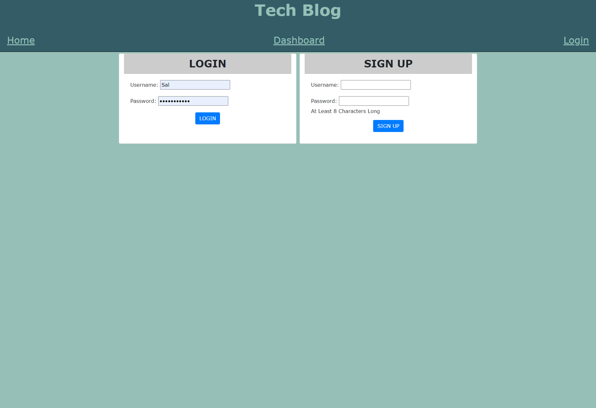
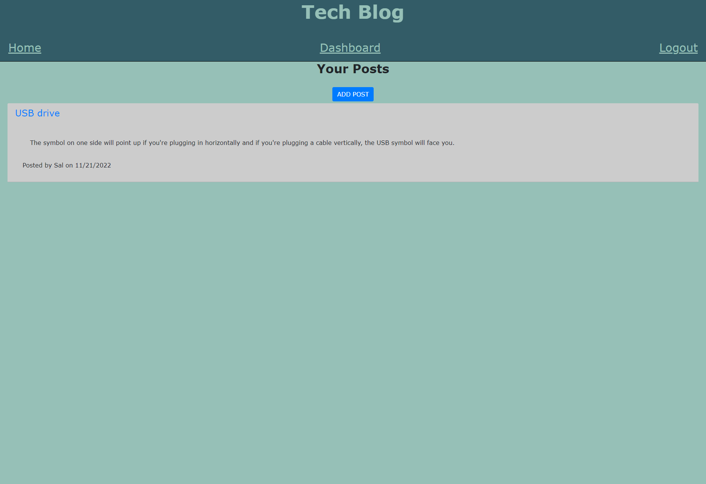
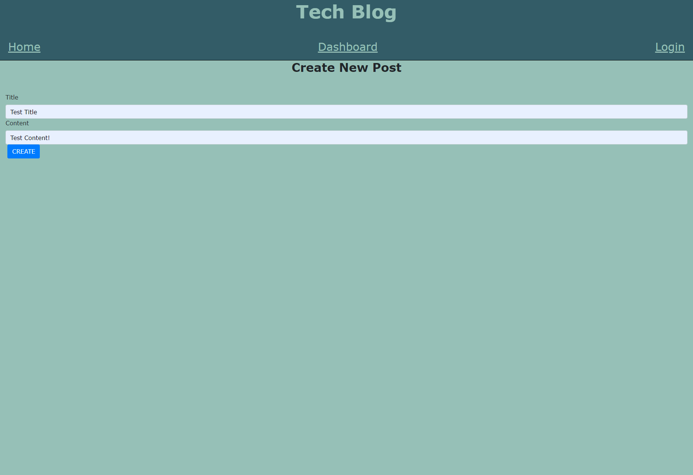
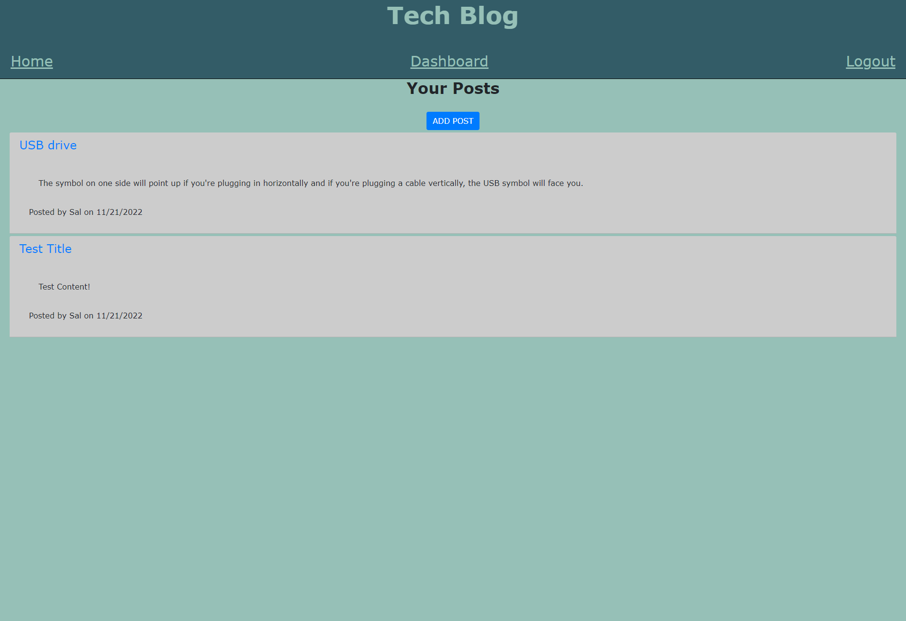
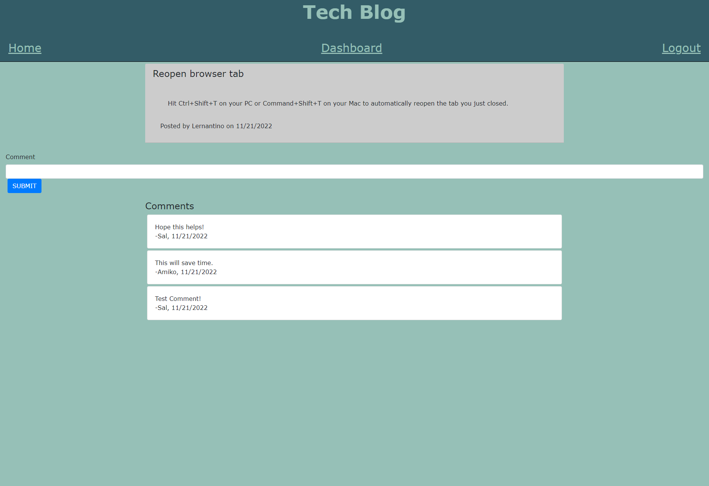
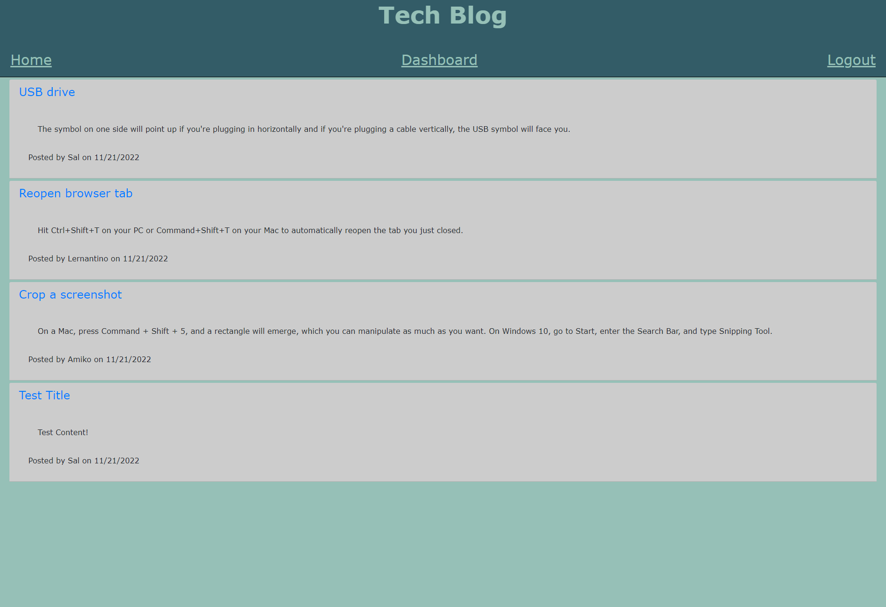

# Tech Blog

## Licensing:

## Table of Contents 
- [Description](#description)
- [Installation](#installation)
- [Usage](#usage)
- [License](#license)
- [Contributing](#contributing)
- [Tests](#tests)
- [Questions](#questions)

## Description:
This is a tech blog created in the UW Coding Bootcamp. On the front-end, the app can be accessed at Heroku.  On the back-end, this is a node command line application that utilizes sequilize, dotenv, mysql2, express, handlebars, and bcrypt.

## Installation:
- Download it through Github
- Ensure express is installed
- Ensure express-handlebars is installed
- Ensure express-session is installed
- Ensure mysql2 is installed
- Ensure sequelize is installed
- Ensure connect-session-sequelize is installed
- Ensure dotenv is installed
- Ensure bcrypt is installed
- To connect to the database, once files are downloaded to you computer, you will need to use a .env file to input your password and username for your mysql.

## Usage:

Webpage:

Back-end after cloning or downloading repo files:
- Open terminal and navigate to tech_blog folder
- Type npm init -y into terminal to create a new .json file
- Type npm i into terminal
- Type npm i express into terminal
- Type npm i express-handlebars into terminal
- Type npm i express-session into terminal
- Type npm i mysql2 into terminal
- Type npm i sequelize into terminal
- Type npm i dotenv into terminal
- Type npm i bcrypt into terminal
- Type npm i connect-session-sequelize into terminal
- Navigate to the db folder
- Type mysql -u root -p into terminal
- Enter your password into terminal
- Type source schema.sql into terminal
- Type quit into terminal
- Navigate back to the tech_blog in terminal
- Type node seeds/index.js so the seeds will populate the database
- Type npm start into the terminal
- You will see the Now Listening indication and can access on your localhost

Screenshots:

Homepage

Login and Sign Up Page

Dashboard Once Logged In

Adding a Post

New Post Shows up on your Dashboard

Adding a Comment to a Post from Another User

User's Comment Added

New Post Shows up on Homepage

## License:
MIT

## Contributing:
Contributions are welcome through forking my repository.

## Tests:
None

## Questions:
- Github: [andreahergert](https://github.com/andreahergert)
- Email: ahergert24@hotmail.com 